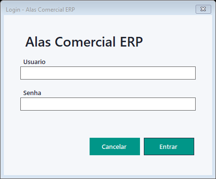
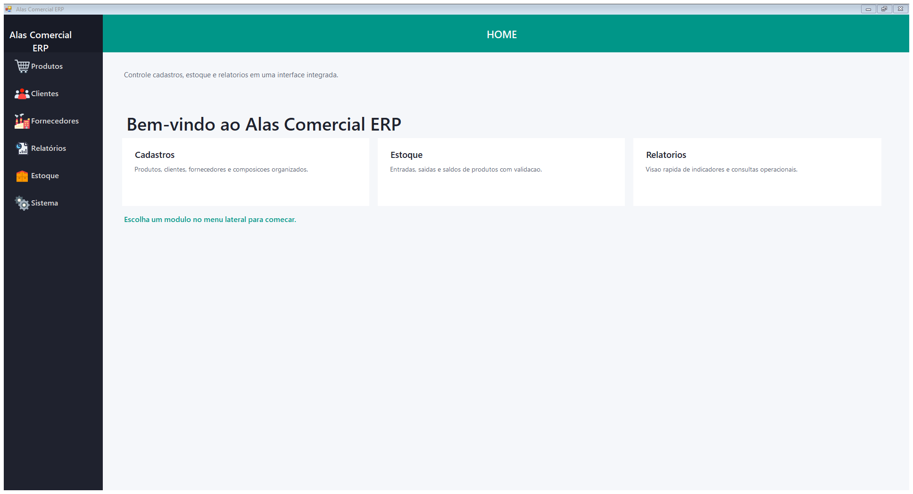
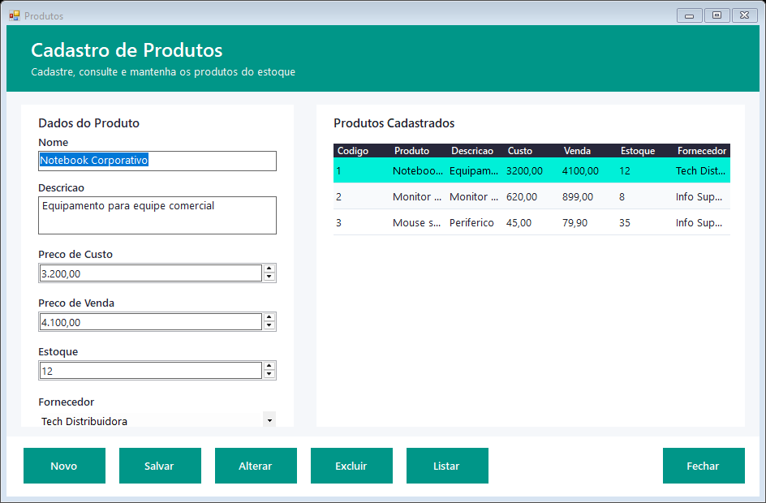
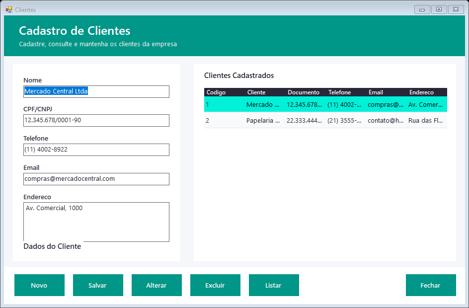
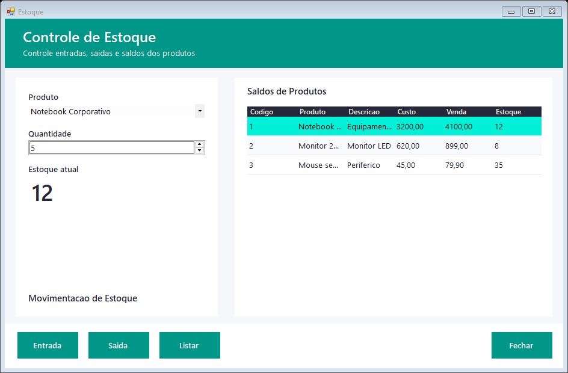
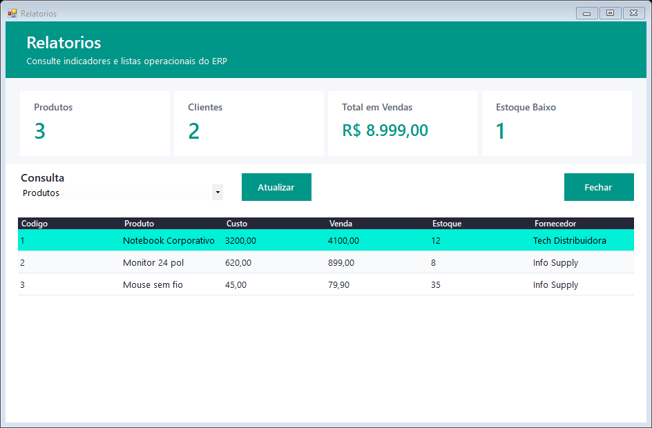
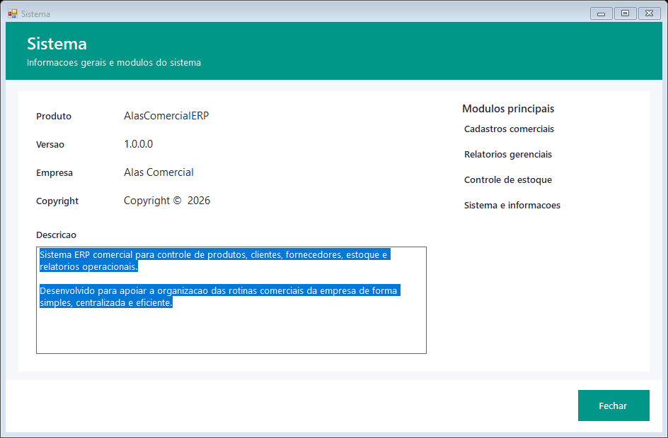
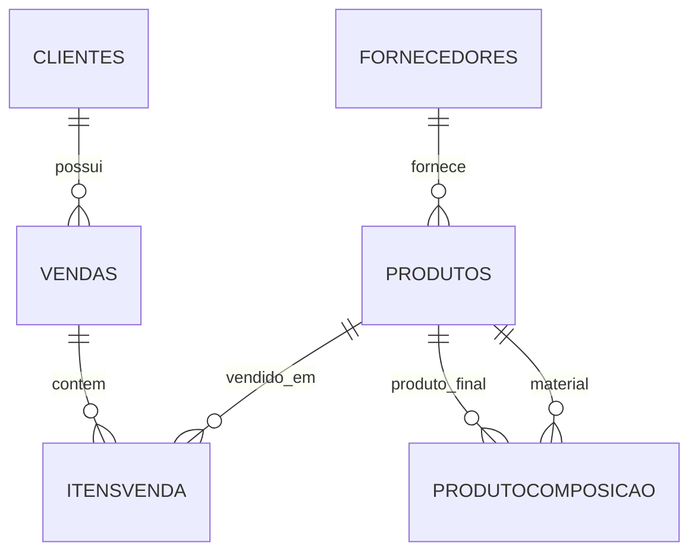
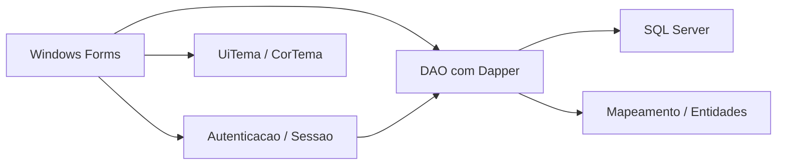

# Alas Comercial ERP

Sistema ERP desktop para rotinas comerciais, desenvolvido em **C# Windows Forms** com **.NET Framework 4.8**, **SQL Server** e **Dapper**. O projeto centraliza cadastros, controle de estoque, consultas operacionais e acesso autenticado em uma interface simples para uso interno.

## Sumario

- [Visao geral](#visao-geral)
- [Telas do sistema](#telas-do-sistema)
- [Funcionalidades](#funcionalidades)
- [Tecnologias](#tecnologias)
- [Estrutura do projeto](#estrutura-do-projeto)
- [Banco de dados](#banco-de-dados)
- [Como executar](#como-executar)
- [Credenciais iniciais](#credenciais-iniciais)
- [Arquitetura](#arquitetura)
- [Boas praticas e observacoes](#boas-praticas-e-observacoes)

## Visao geral

O **Alas Comercial ERP** foi criado para apoiar a organizacao de processos comerciais basicos:

- cadastro e manutencao de clientes;
- cadastro e manutencao de fornecedores;
- cadastro de produtos com precos, estoque e fornecedor;
- entrada e saida de estoque com validacoes;
- consultas e indicadores operacionais;
- login com usuario ativo e senha armazenada por hash e salt.

O sistema usa uma interface WinForms com menu lateral, tela inicial e formularios internos para cada modulo.

## Telas do sistema

As imagens abaixo foram geradas a partir da interface atual do projeto, com dados demonstrativos para facilitar a visualizacao dos modulos.

### Login



### Painel inicial



### Cadastro de produtos



### Cadastro de clientes



### Cadastro de fornecedores


### Controle de estoque



### Relatorios



### Sistema



## Funcionalidades

### Autenticacao

- Login por nome de usuario e senha.
- Criacao/garantia da estrutura da tabela `Usuarios` ao inicializar a autenticacao.
- Usuario inicial administrativo.
- Senhas armazenadas com hash SHA-256 e salt.
- Comparacao de hash em tempo fixo.
- Controle de usuario ativo.

### Produtos

- Cadastro de produtos.
- Edicao e exclusao de registros.
- Listagem em grade.
- Campos de nome, descricao, preco de custo, preco de venda, estoque e fornecedor.
- Associacao opcional com fornecedor.

### Clientes

- Cadastro de clientes.
- Edicao, exclusao e listagem.
- Campos de nome, CPF/CNPJ, telefone, e-mail e endereco.
- Preenchimento automatico do formulario ao selecionar um registro na grade.

### Fornecedores

- Cadastro de fornecedores.
- Edicao, exclusao e listagem.
- Campos de nome, CNPJ, telefone e e-mail.
- Validacao para evitar remocao indevida quando houver dependencias com produtos.

### Estoque

- Consulta de saldos de produtos.
- Entrada de estoque.
- Saida de estoque.
- Validacao de quantidade maior que zero.
- Bloqueio de saida maior que o saldo atual.

### Relatorios

- Cards de resumo com:
  - total de produtos;
  - total de clientes;
  - total em vendas;
  - produtos com estoque baixo.
- Consultas por tipo:
  - produtos;
  - clientes;
  - fornecedores;
  - vendas;
  - estoque baixo.

### Sistema

- Informacoes gerais do produto.
- Versao da aplicacao.
- Empresa.
- Modulos principais disponiveis.

## Tecnologias

| Tecnologia | Uso |
| --- | --- |
| C# | Linguagem principal |
| .NET Framework 4.8 | Runtime da aplicacao desktop |
| Windows Forms | Interface grafica |
| SQL Server / SQL Server Express | Banco de dados relacional |
| Dapper | Acesso a dados e mapeamento simples |
| System.Data.SqlClient | Conexao com SQL Server |
| NuGet packages.config | Gerenciamento de pacotes do projeto |

## Estrutura do projeto

```text
AlasComercialERP/
├── AlasComercialERP.slnx
├── README.md
├── database/
│   └── schema.sql
├── docs/
│   └── images/
│       ├── 01-login.png
│       ├── 02-dashboard.png
│       ├── 03-produtos.png
│       ├── 04-clientes.png
│       ├── 05-fornecedores.png
│       ├── 06-estoque.png
│       ├── 07-relatorios.png
│       └── 08-sistema.png
└── AlasComercialERP/
    ├── App.config
    ├── Program.cs
    ├── PrincipalForm.cs
    ├── Conexao.cs
    ├── UiTema.cs
    ├── CorTema.cs
    ├── Autenticacao/
    ├── DAO/
    ├── Forms/
    ├── Mapeamento/
    ├── Properties/
    └── Resources/
```

### Pastas principais

| Pasta/arquivo | Responsabilidade |
| --- | --- |
| `AlasComercialERP/Forms` | Telas do sistema: login, clientes, produtos, fornecedores, estoque, relatorios e sistema |
| `AlasComercialERP/DAO` | Classes de acesso ao banco usando Dapper |
| `AlasComercialERP/Mapeamento` | Modelos/entidades usados pelos DAOs e formularios |
| `AlasComercialERP/Autenticacao` | Servicos de login, sessao e senha |
| `AlasComercialERP/Resources` | Imagens e icones usados pela interface |
| `database/schema.sql` | Script de criacao do banco e das tabelas |
| `AlasComercialERP/App.config` | String de conexao e configuracoes da aplicacao |

## Banco de dados

O projeto utiliza o banco `alascomercialerp` em SQL Server. A string de conexao padrao fica em `AlasComercialERP/App.config`:

```xml
<add name="AlasComercialERP"
     connectionString="Data Source=.\SQLEXPRESS;Initial Catalog=alascomercialerp;Integrated Security=true;Column Encryption Setting=enabled;Connect Timeout=3;"
     providerName="System.Data.SqlClient" />
```

### Tabelas criadas pelo script

| Tabela | Descricao |
| --- | --- |
| `Clientes` | Dados cadastrais dos clientes |
| `Fornecedores` | Dados cadastrais dos fornecedores |
| `Produtos` | Produtos, precos, estoque e fornecedor vinculado |
| `Vendas` | Cabecalho de vendas |
| `ItensVenda` | Itens vinculados a uma venda |
| `ProdutoComposicao` | Composicao entre produto final e material |
| `Usuarios` | Usuarios, senha hash/salt, status e data de criacao |

### Relacionamentos principais



## Como executar

### Pre-requisitos

- Windows.
- Visual Studio 2022 ou Build Tools com suporte a .NET Framework.
- .NET Framework 4.8 Developer Pack.
- SQL Server Express ou SQL Server.
- Acesso ao servidor SQL configurado na string de conexao.

### 1. Clone ou abra o projeto

```powershell
git clone <url-do-repositorio>
cd AlasComercialERP
```

Se o projeto ja estiver na maquina, abra a pasta ou a solucao `AlasComercialERP.slnx`.

### 2. Restaure os pacotes NuGet

No Visual Studio:

1. Abra a solucao.
2. Clique com o botao direito na solucao.
3. Selecione **Restore NuGet Packages**.

Tambem e possivel compilar pela linha de comando quando o ambiente ja estiver configurado:

```powershell
dotnet build .\AlasComercialERP.slnx
```

### 3. Crie o banco de dados

Execute o script:

```text
database/schema.sql
```

Exemplo com `Invoke-Sqlcmd`, caso o modulo esteja instalado:

```powershell
Invoke-Sqlcmd -ServerInstance ".\SQLEXPRESS" -InputFile ".\database\schema.sql"
```

Tambem e possivel executar o arquivo pelo SQL Server Management Studio ou pelo SQL Server Object Explorer do Visual Studio.

### 4. Confira a string de conexao

Se o SQL Server nao estiver em `.\SQLEXPRESS`, ajuste `AlasComercialERP/App.config`:

```xml
Data Source=.\SQLEXPRESS;Initial Catalog=alascomercialerp;Integrated Security=true;
```

Exemplos comuns:

```xml
Data Source=localhost;Initial Catalog=alascomercialerp;Integrated Security=true;
Data Source=SERVIDOR\INSTANCIA;Initial Catalog=alascomercialerp;Integrated Security=true;
```

### 5. Compile e execute

Pelo terminal:

```powershell
dotnet build .\AlasComercialERP.slnx
.\AlasComercialERP\bin\Debug\AlasComercialERP.exe
```

Pelo Visual Studio:

1. Defina `AlasComercialERP` como projeto de inicializacao.
2. Compile a solucao.
3. Execute com **F5** ou **Ctrl+F5**.

## Credenciais iniciais

O codigo da aplicacao provisiona um usuario administrativo inicial quando nao encontra usuarios validos:

| Campo | Valor |
| --- | --- |
| Usuario | `admin` |
| Senha | `admin123` |

O script `database/schema.sql` tambem inclui um usuario `admin` com hash e salt compativeis com essa senha.

> Recomendacao: altere a senha inicial em ambientes reais e evite reutilizar credenciais administrativas padrao.

## Arquitetura

O projeto segue uma organizacao simples em camadas:



### Fluxo de inicializacao

1. `Program.cs` habilita estilos visuais do WinForms.
2. `LoginForm` solicita usuario e senha.
3. `AutenticacaoService.Inicializar()` garante a estrutura de usuarios.
4. `AutenticacaoService.Autenticar()` valida senha e usuario ativo.
5. Em caso de sucesso, a sessao e registrada em `SessaoUsuario`.
6. `PrincipalForm` e aberto com o menu principal.

### Acesso a dados

Os DAOs herdam de `Conexao`, que cria uma `SqlConnection` usando a connection string `AlasComercialERP`. As consultas e comandos usam Dapper para mapear resultados diretamente para as classes em `Mapeamento`.

Exemplos de DAOs:

- `ClienteDAO`
- `FornecedorDAO`
- `ProdutoDAO`
- `VendaDAO`
- `UsuarioDAO`

## Desenvolvimento

### Compilacao

```powershell
dotnet build .\AlasComercialERP.slnx
```

### Saida da aplicacao

Em modo Debug, o executavel e gerado em:

```text
AlasComercialERP/bin/Debug/AlasComercialERP.exe
```

### Atualizacao do banco

Ao alterar entidades ou DAOs, mantenha o arquivo `database/schema.sql` sincronizado com as tabelas esperadas pela aplicacao.

### Atualizacao dos prints

Os prints usados neste README ficam em:

```text
docs/images/
```

Ao modificar a interface, gere novas imagens mantendo os mesmos nomes de arquivo para evitar quebrar os links do README.

## Boas praticas e observacoes

- A aplicacao depende de um SQL Server acessivel pela string de conexao configurada.
- A senha inicial existe apenas para ambiente de desenvolvimento ou primeira execucao.
- O projeto usa autenticacao com hash e salt, mas ambientes reais devem aplicar politicas adicionais de senha, backup e permissao de banco.
- A string de conexao usa `Integrated Security=true`; portanto, o usuario do Windows precisa ter permissao no banco.
- O tempo de conexao esta configurado como `Connect Timeout=3`, o que acelera falhas quando o banco esta indisponivel.
- Antes de distribuir a aplicacao, gere uma build Release e revise credenciais, connection string e permissoes.

## Status do projeto

O projeto ja possui os modulos principais de um ERP comercial simples: autenticacao, cadastros, estoque, relatorios e tela de informacoes do sistema. Os proximos incrementos naturais seriam historico de movimentacoes, fluxo completo de vendas, filtros de pesquisa, exportacao de relatorios e testes automatizados versionados junto ao codigo-fonte.
